# patztabot22

out-of-the-box:
- `notebook` - interactive notebooks 
- `src` - training and deployment logic
- `bin` - entry scripts (always use these instead of running `src` files directly)

not a part of the repo:
- `data` - datasets, models, cache, ...
- `config`
  - `patztabot_token.txt` - secret Discord bot token for patztabot
  - `patztabot_config.ini` - default Discord bot permissions etc. for patztabot
  - `shellbot_token.txt` - secret Discord bot token for shellbot
  - `shellbot_config.ini` - default Discord bot permissions etc. for shellbot

## RP specification

### Personal AI double

The goal is to train a LLM on the author's messenges online (collected from Meta's Messenger) and integrate the model
into a Discord chatbot. 
The motivation was to create an AI double of the author.
The chatbot should therefore (given e.g. the size limitations of the model)
resemble the author's own way of chatting, and generate (again, given the limitations) appropriate
responses using a live prompt pipeline directly from the Discord chatting application. The Discord bot should have some other
features accessible through commands, such as permissions (whitelist or a blacklist for chatting, ...), and status report.

Subtasks for the RP will possibly include:
- creating a Discord bot with a prompt pipeline for collecting message context
- collecting and preprocessing Messenger data into a dataset
- fine tuning a LLM (small enough for individual use) using a remote cluster on the dataset
- integrating the LLM into the Discord bot
- testing the bot manually or automatically on a set of scenarios (introduction, small talk, discussion, ...)

The Bachelor thesis is expected to focus on what is currently called "AI alignment", especially on aligning pretrained LLMs for downstream tasks, e.g. using parameter efficient fine tuning (PEFT) techniaues, prompt tuning, RLHF, etc.


# Documentation

## patztabot22

The Discord bot `patztabot22` is the focal point of the project. It represents the "AI persona" (an AI double of `patztablook22`) and facilitates all interaction with the underlying LLM. To run the bot, execute `bin/patztabot`, or enqueue (`qsub`) `bin/metacentrum_patztabot` to run it as a Metacentrum job.

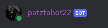

### Communication

To communicate with `patztabot22`, a simple message has to be sent from a `visible` user (see [permissions](#permissions)) either:
- In private messages,
- In a thread created using the bot's `/thread` command (read [commands](#commands)),
- In any channel with its name (or its category's name) prefixed `patztabot22-direct`,
- In any public channel when directly pinged.

When communication is triggered, the model enqueues the message context for response generation. When the LLM worker consumes the context, the `patztabot22 is typing...` Discord status is triggered for as long as the model is generating. The bot skips all messages by non-`visible` users.

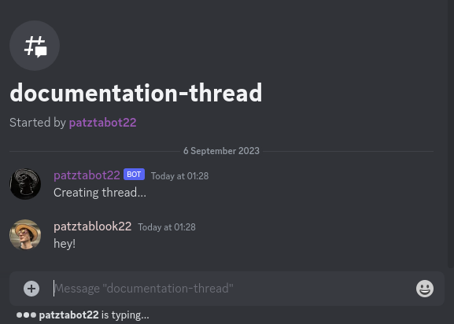

There are two important features regarding message context collection:
- Using the command `/reset` (read [commands](#commands)) prevents the model from seeing earlier messages. This is useful e.g. when the model gets confused by a particular message.
- Any message with the prefix `!` (e.g. "! hello world") is completely ignored by the bot. This makes it easy to make hidden notes or communciate with other users in channels where normal messages trigger a response.

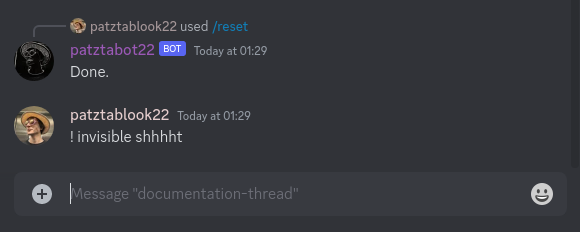

### Permissions

The primary permission system of the bot is constituted by the following hierarchy:
- Onwer
- Admin
- Mod
- Visible
- Ignored

The default level assigned to users and specific user permissions (e.g. the owner) can be given to the bot in the config file `config/patztabot_config.ini`:

```ini
[permissions]

# ignored by default (level 0)
default = 0

# the Discord user with given ID is the owner (level 4)
saved =
    620968062044209172 4
```

The primary permissions can be changed by using the `/permission get/set` commands (see [commands](#commands)). A user can change the permissions of only lower-level users and can never grant higher or equal level to its own (for example, an admin has access to the bottom three levels - ignored, visible, mod - but not to the owners and to itself). Permissions are cached so that restarting the bot does not necessitate manually setting up the permissions again.

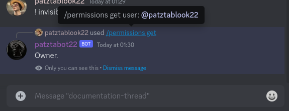
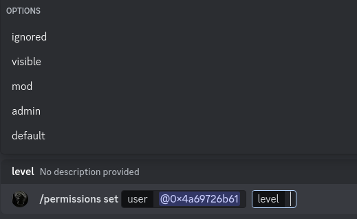


In addition to this global (across-server) hierarchy, the bot can take into account the roles on trusted servers (such as the private development/testing server - `Sanctuary of the great patztabot22`). For example, a user with the role `visible` is automatically visible to the bot without the need of modifying its primary permission hierarchy.

### Evaluation pipeline

To quickly evaluate the model, there is an evaluation pipeline, triggered by `/test` (see [commands](#commands)):
- Finds all test channels - any channel with its name (or its category's name) prefixed by `patztabot22-test`. These channels contain test scenarios (introduction, personal question, intellectual question, ...).
- Deletes its own previous messages from the test channels.
- Generates new responses.

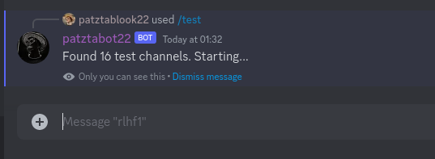
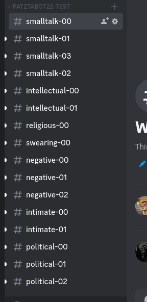


### Commands

- `/shutdown` - shuts the bot down
- `/restart` - restarts the main bot file (changes to the source code with take effect)
- `/ping` - responds `Pong.`
- `/asdf` - triggers debugging response, whatever it may be
- `/test` - triggers the [evaluation pipeline](#evaluation-pipeline)
- `/reset` - prevents the bot from seeing earlier messages
- `/generate prompt:str` - generates a response to a manually provided prompt
- `/thread name:str` - creates a thread for direct [communication](#communication) with the bot
- `/permissions get user:user` - queries the [level](#permissions) of the user in the bot's primary hierarchy
- `/permissions set user:user level:str` - modifies the [level](#permissions) of the user in the bot's primary hiearchy

## Shell

The discord bot `Shell` is a helper bot for executing important scripts such as model fine-tuning. Originally, I used to enqueue such scripts directly to Metacentrum. This, however, had the following drawbacks:
- Queue waiting time - very inconvenient for debugging - enqueue, view log file with errors, repeat.
- No real-time IO. 

The bot tackles both of these disadvantages by:
- Running as the outer ("shell") Metacentrum service.
- Creating subprocesses on the fly using Discord commands and forwarding their IO back to Discord.

For security reasons, this bot only allows interaction to manually selected users in the bot's configuration (see [permissions](#shell-permissions)).


### Jobs

The main unit of `Shell` is a `Job`. To run a job, the script and arguments must be given to the `/job run` command (see [commands](#shell-commands)). This automatically triggers a #view creation for that job. All jobs (finished or running) can be listed by `/job list`. A job can be killed by giving its ID to `/job kill`.


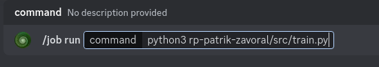
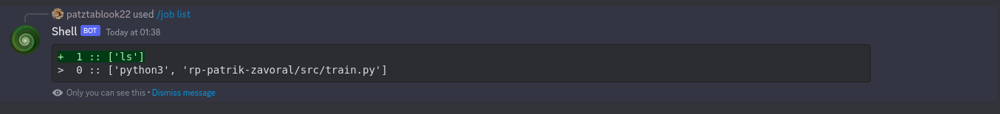
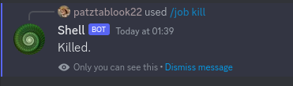


### Views

View is a pseudo-terminal for interacting with jobs. To create a view for a job, give its ID to `/job view`. A view, consisting of the following elements, will be generated:
- Report log - job ID on the top, below real-time STDOUT/STDERR of the job.
- Control buttons - trash can to close the view (does not affect the underlying job), a skull to kill the underlying job (without closing the view).

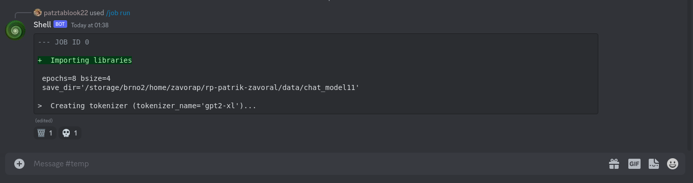


### Shell permissions

The `admin` privilege has to be given manually in the bot's configuration, `config/shellbot_config.ini`:

```ini
[permissions]
admins: 
    620968062044209172
```

The reason for this is that the ability to run and interact with arbitrary programs on the host's machine poses security risks. Also, given that this bot only controls model training logic etc., it does not need a multi-level permission hierarchy similar to `patztabot22`'s.

### Shell commands

- `/shutdown` - shuts the bot down
- `/restart` - restarts the main bot file (changes to the source code with take effect)
- `/ping` - responds `Pong.`
- `/job run command:str` - [runs](#jobs) command, usually `program arg1 arg2 arg3 ...`
- `/job list` - lists jobs - ID, arguments, status (running/success/failed)
- `/job view job:int` - creates a new [view](#views) for the given job (identified by its ID)
- `/job kill job:int` - kills the job (identified by its ID)


## Dataset pipeline

The dataset is being prepared using `notebook/dataset.ipynb`. Roughly, it proceeds in the following steps:
1. Loading conversations.
2. Processing conversations.
3. Dumping everything into the final `.txt` file.

Each of these steps uses methods and classes in the `src/dataset.py` module. Messages in all languages (similar amount of Czech and English messages) were included. The final training file has the size of around 12 MiB and contains around 200 thousand messages.

### Loading conversations

Messenger conversations can be loaded from an officially downloaded Meta archive. Further, custom simulated conversations can be loaded. These are saved as `.txt` files with the following format:

```txt
User1: blah blah
User2: indeed
User1: bye
User2: bye
```

The simulated conversations were used to train the model specific situations that are not present in the dataset (e.g. introduction) or to override the dataset-trained response (e.g. mentioning the bot's inability to open URL links).

To load them:
```py
messenger_conversations = dataset.load_messenger_conversations("/path/to/the/messages")
simulated_conversations = dataset.load_simulated_conversations("/path/to/the/dir")
```

Both methods return lists of `Conversation`s. A conversation can be thought of as a chronologically ordered list of `Message`s with additional `title` and `participants` attributes. A `Message` is a dataclass consisting of `author`, `content`, `timestamp`. Timestamp is a float - unix time in seconds with possible decimals for higher precision.

### Processing conversations

Using `dataset.rename_conversation_user`, the username representing myself is renamed to `you` in all conversations.

Each simulated conversation is copied 5 times, and the other "dummy" username is randomly sampled. This results in having multiple identical simulated conversations with the exception of the username of the dummy user:

```py
names = ['alice', 'bob', ...]
conversation = ...
sampled_conversations = dataset.sample_names(conversation, 'User1', names, 5)
```

Messages are removed from the conversations, if they
- Are too long.
- Indicate a mistake correction or a reply (e.g. "." is often used to pinpoint a previous message by replying to it, mistake corrections are usually of the form "*correction").
- Are overused by the resulting language model, with the purpose of down-sampling (e.g. messages like "lol", "xd"). This happens randomly with given probability (e.g. `0.5`), such that their occurence is not eliminated altogether.


Moreover, an `[AVOID]` token is prepended in front of given patterns, notably URLs. This is done when deleting the messages may disrupt the conversation flow. The model will be still able to learn about such patterns in the dataset (and will also learn to prepend them with the `[AVOID]` token). During generation, the `[AVOID]` token is blacklisted, effectively censoring such patterns (the model can't *generate* URLs, ...).

### Dumping conversations into the final `.txt` file

All conversations are first split into shorter conversations of at most 100 messages, which are then shuffled.

The final file is in the following format:

```txt
[CSTART]
[MSTART]username1[WRITES]something[BREAK]
followup[BREAK]
another followup[MEND][BREAK]
[MSTART]username2[WRITES]a reply[MEND][BREAK]
...
[CEND]
[CSTART]
...
[CEND]
```

The special tokens `[CSTART]`, `[CEND]` indicate the start and the end of the conversation. `[MSTART]` indicates the start of a message block, consisting of the author, the token `[WRITES]`, and multiple submessages. 

A submessage is a piece of text that can be sent by the bot right away, instead of finishing the entire message. The purpose for this is that the conversations in the dataset usually contain a lot of shorter (sub-)messages sent in a short timespan (threhold set for 3 minutes), instead of being sent as large coherent units (which would be the case with e.g. letters or mails).

Although somewhat irregular, the `[MEND]` (message end) token is intentionally in front of the message's last `[BREAK]`, instead of immediatelly following it. The reason for this is that the model generation is configured to stop when encountering the `[BREAK]` token. Whether the model should generate another submessage or not is then checked by looking at the last token of the generated response. If it is the `[MEND]` token, the entire message has been generated, otherwise more submessages are to be generated.


## Fine-tuning

The entire pretrained model (`gpt2-xl`) is finetuned on chunks of random sizes (64, 128, 256 tokens) in order to force the model to learn from both shorter and longer contexts.

The loss function is masked such that the model only learns to generate messages from whitelisted users (notably myself). Since the loss for the non-whitelisted users is masked to 0, there is no gradient making the model generate their messages. This however still enables the model to use these non-whitelisted messages as a context for generating the whitelisted ones. Without this, the model would have no way of learning the dynamics of a conversation with a non-whitelisted user.

Metacentrum's batch computing services have been used. On a A40 GPU (44 GiB memory), training for 8 epochs with the batch size of 4 takes around 12 hours. This amount of epochs has been chosen to avoid overfitting the dataset or forgetting the original pre-training data.
