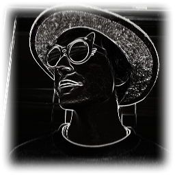

# patztabot22

A custom LM trained to mimic me personally.

- [RP specification](docs/rp-specification.md)

Related projects:
- [Genbot](https://github.com/patztablook22/genbot) - Generative LM deployment on Discord.
- [Shellbot](https://github.com/patztablook22/shellbot) - Remote shell over a Discord bot for training on remote clusters.
- [Metacentrum LLM quickstart](https://github.com/patztablook22/metacentrum-llm-quickstart) - Minimal project structure to get LLMs running on Metacentrum primarily created for [NPFL101 - Competing in Machine Translation](https://ufal.mff.cuni.cz/courses/npfl101).
